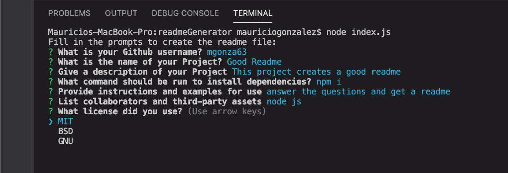
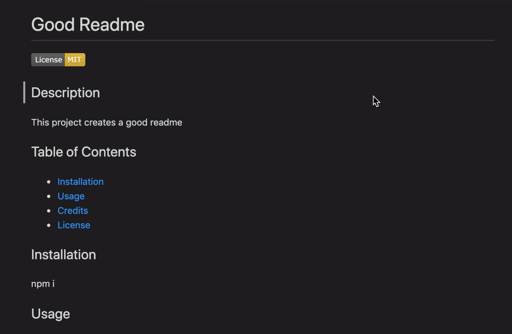

# Good Readme

##    
[](https://opensource.org/licenses/MIT)

## Description 
    
This project generates a nice readme for any project you want, within seconds you can generate the perfect readme for your project. It also adds your github profile picture and a banner according to your license. 

```
async function init() {
    console.log("Fill in the prompts to create the readme file:");

    try {
      const answers = await promptUser();

      const username = answers.myGithub;

      const image = await getImage(username);

      const license = answers.myLicense;

      const banner = await getBadge(license);

      const md = generateREADME(answers, image, banner);

```

The code above is to show a basic way of waiting for the answers from the user to change the actual data inside the function that creates the readme file. It was used two times, one for the picture of the user's profile, and the badge according to the user's license. Check out the index.js in this repo for more information.
    
## Table of Contents
    
    
* [Installation](#installation)
* [Usage](#usage)
* [Credits](#credits)
* [License](#license)
    
    
## Installation
    
Inquirer, Util, Axios
    
## Usage 
    
clone this repo and all the files should be ready, run the index.js through node and you will be prompted with a few questions.



    
## Credits
    
Node JS
    
## License
    
MIT

## Tests

npm test



## Contributing

Submit bugs and feature requests

